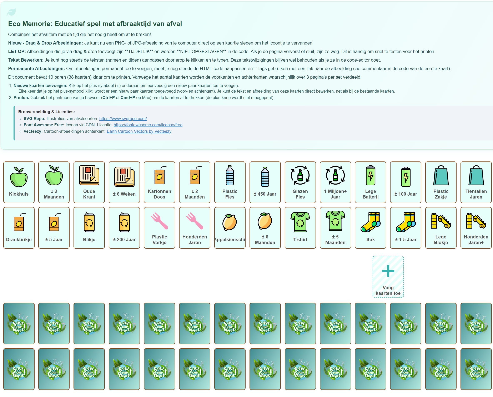

# Memorie Spel: Afbraaktijd van Afval (Printbaar & Bewerkbaar)

Dit is een educatief memorie spel voor kinderen (ongeveer 6-12 jaar) om op een speelse manier te leren over de afbraaktijd van verschillende soorten afval. Het project bevat een printbaar HTML-bestand met 20 paren kaarten.

## Kenmerken

* **Printbaar:** Ontworpen om eenvoudig te printen op A4-papier (enkel- of dubbelzijdig).
* **Thema:** Afval en afbraaktijden. Elk paar bestaat uit een kaart met de naam van het afval en een kaart met de geschatte afbraaktijd.
* **Bewerkbare Tekst:** De namen en afbraaktijden op de kaarten kunnen direct in de browser worden aangepast vóór het printen via `contenteditable`.
* **Drag & Drop Afbeeldingen (Tijdelijk):** Vervang de standaard icoontjes snel door eigen PNG/JPG afbeeldingen te slepen op de kaartjes in de browser. **Let op:** Deze wijziging is tijdelijk en wordt niet opgeslagen in de code.
* **Aanpasbare Afbeeldingen (Permanent):** Mogelijkheid om de standaard Font Awesome icoontjes permanent te vervangen door eigen afbeeldingen door de HTML-code aan te passen (`` tags).
* **Taal:** Nederlands.
* **Styling:** Frisse kleuren en effecten (ook bij printen in kleur).

## Hoe te Gebruiken & Printen

1.  **Openen:** Download het `index.html` bestand (of de bestandsnaam die je hebt gekozen) en open het in een moderne web browser (Chrome, Firefox, Edge, etc.).
2.  **Tekst Aanpassen (Optioneel):** Klik direct op de namen of afbraaktijden op de voorkant-kaartjes in de browser en typ je eigen tekst. *Let op: Voor permanente wijzigingen, bewerk de tekst direct in de HTML-code (`...`).*
3.  **Afbeeldingen Slepen (Optioneel & Tijdelijk):** Sleep een .png of .jpg bestand van je computer naar een voorkant-kaartje om het icoontje tijdelijk te vervangen voor deze print-sessie.
4.  **Printen:**
    * Ga naar de print-functie van je browser (`Ctrl+P` of `Cmd+P`).
    * **Belangrijk:** Zorg ervoor dat de optie **"Achtergronden afdrukken"** (of "Background graphics") is **ingeschakeld** in de printinstellingen (vaak onder "Meer instellingen"). Anders worden kleuren en het verloop niet correct geprint.
    * **Dubbelzijdig:** Kies voor dubbelzijdig printen en selecteer "Omdraaien langs lange zijde" (Long-edge binding). De printer zou de voorkanten (pagina 1-3) en achterkanten (pagina 4-6) correct moeten combineren.
    * **Enkelzijdig:** Print alle pagina's. Knip de kaarten uit langs de stippellijnen en lijm de bijbehorende voor- en achterkanten aan elkaar.

## Permanente Aanpassingen (Afbeeldingen)

Om de standaard icoontjes permanent te vervangen door eigen afbeeldingen:

1.  Open het `index.html` bestand in een teksteditor of code-editor.
2.  Zoek de kaart die je wilt aanpassen in de `
` sectie.
3.  Vind de `
 <i class="..."></i> 
`.
4.  Vervang de volledige `<i>...</i>` tag door een `` tag. Zorg dat het `src`-attribuut correct verwijst naar jouw afbeeldingsbestand (dit kan een web-URL zijn of een lokaal pad als de afbeelding in dezelfde map staat).
    * Voorbeeld: `
  
`
5.  Sla de wijzigingen op in het HTML-bestand.

## Hosting

Dit project is een statische HTML-pagina en kan eenvoudig gehost worden via [GitHub Pages](https://pages.github.com/).

https://sandercuppen.github.io/Memory/

## Licentie & Bronvermelding

Dit project wordt uitgegeven onder de **MIT Licentie**. Zie het `LICENSE` bestand voor details.

## Bronvermelding & Licenties

* **SVG Repo:** Illustraties van afvalsoorten. [https://www.svgrepo.com/](https://www.svgrepo.com/)
* **Font Awesome Free:** Iconen worden geladen via CDN. Licentie: [https://fontawesome.com/license/free](https://fontawesome.com/license/free) (Icons: CC BY 4.0, Fonts: SIL OFL 1.1, Code: MIT License)
* **Vecteezy:** Cartoon-afbeeldingen achterkant. [Earth Cartoon Vectors by Vecteezy](https://www.vecteezy.com/free-vector/earth-cartoon)

